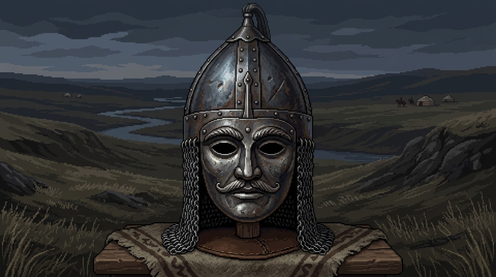

<!-- REALISTIC KIPCHAK PIXEL ART GITHUB PROFILE -->

  

 

  

---

### 🏹 About Me

> *"Like the ancient Kipchak warriors of the Eurasian steppe, I navigate complex spaces with focus, endurance, and quiet craftsmanship."*

👋 **Greetings! I am a Vibecoder** building software driven by curiosity and raw passion. I code whatever catches my interest—unbound by rigid frameworks, preferring clean logic and deep technical challenges.

- 🧬 **Primary Focus:** Molecular Biology Computations, Structural Bioinformatics & Sequence Algorithms.
- 🏹 **Theme & Vibe:** Grounded Turkic heritage, Kipchak iron mask pixel aesthetics, and steppe solitude.
- 💻 **Mindset:** *"Vibecode freely, craft cleanly, explore relentlessly."*
- ⚡ **Bio-fact:** DNA is nature's ultimate 4-letter pixel code (`A`, `T`, `C`, `G`).

---

### 🧬 Molecular Biology & Computational Focus

My computational lab focus areas for upcoming projects and experiments:

| Area | Focus & Research Topics | Key Technologies |
| :--- | :--- | :--- |
| 🧪 **Structural Bio & Folding** | Protein structure analysis, docking simulations & 3D coordinate parsing | `Python` `PyMOL` `Biopython` |
| 🧬 **Genomic Data Pipelines** | High-performance DNA/RNA sequence alignment & variant detection | `Rust` `C++` `Nextflow` |
| 🤖 **AI for Life Sciences** | Machine learning models for biological sequence prediction | `PyTorch` `Scikit-learn` |
| ⚡ **Bio-Algorithms** | Graph theory applications in metabolic pathways & phylogenetic trees | `Python` `NetworkX` |

---

### 🛠️ Tech Stack & Bio-Arsenal

<b>💻 Languages & Core Systems</b>

 

<b>🧬 Computational Biology & Data Science</b>

 

<b>🛠️ Tools & Environment</b>

 

---

### 📊 GitHub Activity & Stats

  
  

 

  

---

### 🐍 Contribution Journey

  

---

### 🌐 Connect & Vibecode

  
  
  

 

  🏹 <i>Crafted with Kipchak endurance &amp; Molecular Code</i> 🧬

